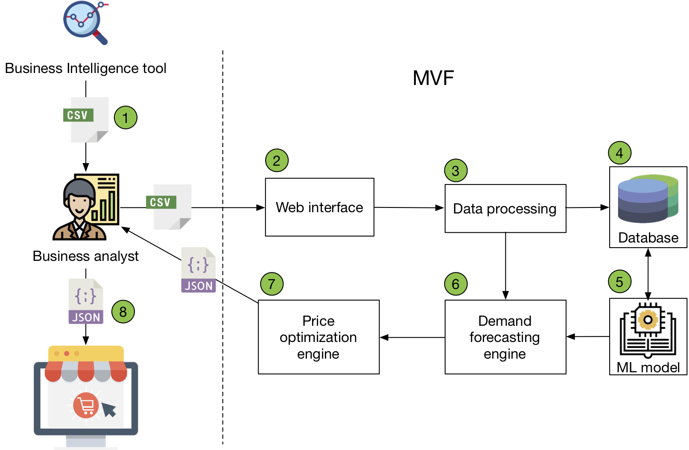

# Online appendix for the paper: "Leveraging Business Transformation with Machine Learning Experiments"
D.I. Mattos, J. Bosch, H. H. Olsson, "Leveraging Business Transformation with  Machine Learning Experiments", in the proceeding of the 10th International Conference on Software Business, Jyväskylä, Finland @ November 18-20, 2019.

# The continuous experimentation process
During the first workshop, we identified 4 business applications of data analytics and ML to understand and improve demand prediction and profit on remaining stock.  The main result of the first workshop was to identify and prioritize the different hy-pothesis associated risk, costs, the feasibility of projects and the ability to evaluate the ML system even in early stages of the development. A dynamic pricing system for remaining stock during the markdown period was selected due to the low risk, relevant return on investment and the smaller number of stakeholders involved. 

The second workshop focused on refining the dynamic pricing hypothesis. It was decided to develop a system that could be used in a specific market segment during the Winter 2018/19 markdown period. Previously, decisions regarding the price re-duction of this segment were based on earlier experiences, and the company saw a gap opportunity to increase profit.

A minimum viable product (MVP) was developed by the authors and iterated con-tinuously with the business analysts and planners (the consumers of the MVP) re-sponsible for price determination. Before the markdown period, the MVP was used by the business analysts and periodic qualitative feedback was collected. From the early iterations, it was identified that integration with the business intelligence tool would require a significant time to develop, validate and verify the process for a proof of concept product without measured value. Based, on such feedback, it was decided to keep the data collection and price-setting manually. The MVP would manually receive the data exported by the business intelligence tool and output data in a format that the e-commerce platform could read. 

The MVP was used and evaluated in an experiment for 1 month, where it dynami-cally determined the discount level of 49 products daily. During this period regular meetings ensured the product was behaving as expected by the company, by observ-ing stock levels, profit gain, comparing with historical trends and with a control group of products that had fixed pricing. After the experiment period, the company determined the discount level based on their previous practices. 

# The dynamic pricing system

The deployed MVP and the daily steps for calculating the dynamic pricing are represented below. 

We can divide the set of activities executed daily in the pricing system in eight sequential steps.

Step 1: The business analyst retrieves the product information of the previous day from the business intelligence tool. The data contains the features that are used in the forecasting and price optimization system, such as number of sold units, price, dis-count level (from the markdown period), average additional discounts (e.g. coupons), timestamp, number of web visualizations, etc.

Step 2: The data is uploaded in a simple web interface of the MVP. 

Step 3: The uploaded data is verified and if it does not agree with the predeter-mined format or if it corresponds to data already uploaded it warns the business ana-lyst. The data can also be uploaded in batch for the historical data. 

Step 4: After validating and processing, the data is saved in a database so it can be used for training and execution of the ML models.

Step 5: For the product launch we used an ML model based on time series analy-sis called ARMA-X (Auto-Regressive Moving Average with eXogenous variables), based on the statsmodels  Python 3 library.

Step 6: This step is concerned with the prediction of the sales. From our offline analysis, we observed that the prediction models were not precise for predicting more than 7 days. This observation restructed of the time window where the utility func-tion could be evaluated on the price optimization engine. We assumed that all predic-tion factors with exception of time-related factors (day of the week and month) and the price were constant and equal to the last day of data (often the previous day). The forecasting system predicts sales for all allowed price range (for most of the products between 10-50% discount). Since we need to perform this calculation daily, for all 49 products, and preferably in short time frame (as it is integrated manually), we opted to reduce the scope of the prediction to 5% discount steps. Therefore, we would fore-cast sales for only 8-12 price steps. This restriction in the MVP allows the system to run faster and without the complexity of integrating it with a mixed-integer linear solver.

Step 7: In this step, the price optimization engine receives the predictions for all products for the next 7 days. Since the company does not want only to maximize the profit but also eliminate the remaining stock, the system performs an optimization task balancing these two utilities. Traditional operational research in areas with more stable demands (such as commodities, airlines tickets etc.) solves this problem by adding a restriction of having a minimum stock (or zero) at the end of the markdown period. However, due to competitors, changes in fashion and other external trends the forecasting for a period longer than 7 days was leading the system to underperform in offline evaluation. To address this problem, we decided to balance the relative im-portance of each utility linearly. We normalized the sales and the profit for a week prediction between 0 and 1, and the business analyst assigned relative weights to them based on the perceived goal of the sales, i.e. to increase profit while keeping a steady reduction of the remaining stock. It was assigned a relative weight of 70% for the stock reduction to 30% of the profit. To perform this simplified optimization for all 49 products took an average of 10 minutes in a Linux VM with 8GB of RAM and Intel Xeon X5 with 2.5GHZ processor. 

Step 8: In the last step, the business analyst takes the results of the price optimiza-tion engine and update the price specification in the e-commerce platform.

# Analysis of the experiment

